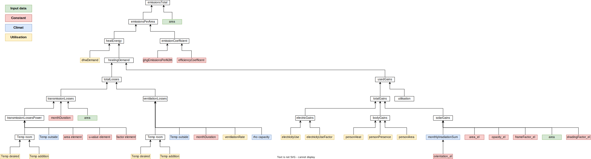

```{r, include = FALSE}
knitr::opts_chunk$set(
  collapse = TRUE,
  comment = "#>"
)
```

Cette page revient sur les différentes étapes menant au calcul des émissions de CO2 totales. L'explication part de la formule final, et remonte jusqu'aux données brutes.  

::: {#hello .alert .alert-primary}
**NOTE**  
La norme SIA 380/1, utilisée comme base pour les calculs, n'était pas disponible lors de la creation de cette documentation. Les explications proviennent donc d'analyses de reverse engeneering se basant sur les noms des fonctions et des variables, ainsi que sur les commentaires dans le code. Les formules, unités, explications des variables et de la logique peut donc être erronées.  
:::

# Architecture de l'algorithme

Afin d'arriver au résultat final des emissions totales retournées par la fonction principale `calculate_emissions()`, plusieurs fonctions sont appelées. La'crchitecture de l'algorithme est présenté dans le diagramme suivant.  
Pour l'ouvrir en grand: [function_call_diagram.svg](img/function_call_diagram.svg)



# Description des variables

Nom | Unité | Description
--|--|-----------
$area$ | $m^2$ | Surface totale du bâtiment (avec étages).
$emissionsTotal$ | $kg$ | Total annual CO2 emissions.
$emissionsPerArea$ | $\frac{kg}{m^2}$ | Total annual CO2 emissions per square meter.
$heatEnergy$ | $\frac{MJ}{m^2}$ | Total annual heat energy required per square meter.
$emissionCoefficient$ | $\frac{kg}{MJ}$ | CO2 emissions per usable MJ of heat energy according to the given heating system and its year of installation.
$ghgEmissionsPerMJth$ | $\frac{kg}{MJ}$ | CO2 emissions per MJ of heat energy in a given given energy carrier.
$efficiencyCoefficent$ | $-$ | Energy efficiency of the heating system.
$heatEnergy$ | $\frac{MJ}{m^2}$ | Total annual heat energy required per square meter.
$dhwDemand$ | $\frac{MJ}{m^2}$ | Annual Domestic Hot Water heat energy required per square meter. Vector of 12 monthly values.
$heatingDemand$ | $\frac{MJ}{m^2}$ | Annual building heat energy required per square meter. Vector of 12 monthly values.
$totalLosses$ | $\frac{MJ}{m^2}$ | Annual building heat losses per square meter. Vector of 12 monthly values.
$totalGains$ | $\frac{MJ}{m^2}$ | Annual building heat gains per square meter. Vector of 12 monthly values.
$transmissionLosses$ | $\frac{MJ}{m^2}$ | Annual building heat transmission losses per square meter. Vector of 12 monthly values.
$transmissionLossesPower$ | $W$ | Power of the transmission losses for each elements of the building envelope (wall, roof, floor, window), and a given outside temperature.
$T_{room}$ | $°C$ | Indoor temperature.
$T_{outside}$ | $°C$ | Outdoor temperature.
$area_{el}$ | $m^2$ | Surface of an element of the building envelope (wall, roof, floor, window).
$uValue_{el}$ | $\frac{W}{m^2 \cdot °C}$ | U-value (thermal transmittance) of an element of the building envelope (wall, roof, floor, window).
$factor_{el}$ | $-$ | Undefined factor influencing the transmission loss of an element. Defaults to 1 (no effect).
$opacity_{el}$ | $-$ | Proportion of solar radiation that is transmitted through a window. Values range from 0 (no transmission) to 1 (full transmission).
$frameFactor_{el}$ | $-$ | Proportion of the window area made up by glass and not the frame, affecting the overall solar gain through the window.
$shadingFactor_{el}$ | $-$ | A factor representing the effect of shading devices on reducing solar gains through a window. Values range from 0 (full shading) to 1 (no shading).
$ventilationLosses$ | $\frac{MJ}{m^2}$ | Annual building heat ventilation losses per square meter. Vector of 12 monthly values.
$ventilationRate$ | $\frac{m^3}{m^2 \cdot h}$ | Rate at which outdoor air replaces indoor air within a given space per houre per square meter.
$\rho_{capacity}$ | $\frac{J}{m^3 \cdot °C}$ | Specific heat capacity of air at constant pressure.
$usedGains$ | $\frac{MJ}{m^2}$ | Annual heat gains that are effectively used within the building. Vector of 12 monthly values.
$totalGains$ | $\frac{MJ}{m^2}$ | Annual heat gains available to the building. Vector of 12 monthly values.
$electricGains$ | $\frac{MJ}{m^2}$ | Annual electric heat gains available to the building. Vector of 12 monthly values.
$electricityUse$ | $\frac{MJ}{m^2}$ | Annual electricity use of the building. Vector of 12 monthly values.
$electricityUseFactor$ | $-$ | Proportion of the consumed electricity that translates into heat gains.
$bodyGains$ | $\frac{MJ}{m^2}$ | Annual heat gains from human body heat available to the building. Vector of 12 monthly values.
$personHeat$ | $W$ | Heat produced by a person.
$personPresence$ | $h$ | Time spent by a person in the building.
$personArea$ | $m^2$ | Area occuped per person in the building.
$solarGains$ | $\frac{MJ}{m^2}$ | Annual solar heat gains available to the building. Vector of 12 monthly values.
$monthlyIrradiationSum$ | $\frac{MJ}{m^2}$ | Monthly solar irradiation on a given orientation of the building. Vector of 12 monthly values.
$utilisation$ | $-$ | Efficiency with which a building can utilize the available heat gains to offset its heating demand.
$ratio$ | $-$ | Ratio of total heat gains to total heat losses for each month.
$utilisationParam$ | $-$ | Parameter that represents the efficiency with which a building can utilize the available heat gains.
$timeConst$ | $h$ | Heating time constant of the building.
$heatCapacity$ | $\frac{MJ}{m^2 \cdot °C}$ | Building's heat storage capability per square meter.
$heatTransferCoefficient$ | $\frac{W}{°C}$ | Heat transfer coefficient of the building envelope.

# Equations

## emissionsTotal

The function `getEmissions()` implements this equation.  

Calcul des émissions totales annuelles de CO2, sur toute la surface du batiment.  

$$emissionsTotal = area \cdot emissionsPerArea$$

## emissionsPerArea

The function `getEmissions()` implements this equation.  

Calcul des émissions annuelles de CO2 par mètre carré, en fonction de l'énergie de chauffage requise et du coefficient d'émission du type de chauffage.  

$$emissionsPerArea = heatEnergy \cdot emissionCoefficient$$

## emissionCoefficient

The function `getEmissions()` implements this equation.  
Le coefficient d'émission est calculé en fonction du type de combustible utilisé et de l'année d'installation du système de chauffage.  
Ces donées de `ghgEmissionsPerMJth` et `efficiencyCoefficent` proviennent du dataset `constants()`. 
$$emissionCoefficient = \frac{ghgEmissionsPerMJth}{efficiencyCoefficent}$$

## heatEnergy

The function `Q_Total()` implements this equation.  
$$heatEnergy = dhwDemand + heatingDemand$$

## dhwDemand

The function `Q_DHW_Demand()` implements this equation.  
Ces donées proviennent directement du dataset `utilisation()`, en fonction du type de batiment. 

## heatingDemand

The function `Q_Heating_Demand()` implements this equation.  
$$heatingDemand = totalLosses - usedGains$$

## totalLosses

The function `Q_Losses_Total()` implements this equation.  
$$totalLosses = transmissionLosses + ventilationLosses$$

## transmissionLosses

The function `Q_Losses_Transmission()` implements these equation.  
The function applies formulas 76-96 of the SIA 380/1 norm, and aligns with varaible `Q_T`.  

Tout d'abords, pour chaque température moyenne extérieurs mensuelles, et pour chaque éléments de l'enveloppe du batiment (murs, toit, fenetres, sol), on calcule la puissance des pertes par transmission, donc en watt. Ce calcul est expliqué dans la section [transmissionLossesPower](#transmissionLossesPower).  

Ensuite, nous pouvons transformer cette puissance en énergie, en multipliant par le nombre de secondes dans le mois. Nous divisons par $10^6$ pour obtenir le résultat en MJ, et par la surface du batiment pour obtenir le résultat par mètre carré. 
$$transmissionLosses = \frac{transmissionLossesPower \cdot monthDuration_{s}}{10^6 \cdot area}$$

## transmissionLossesPower

The function `calculateTransmissionLosses()` implements this equation.

La puissance des pertes par transmission, donc en watt, est calculée pour chaque éléments de l'enveloppe du batiment (murs, toit, fenetres, sol), et pour chaque température moyenne extérieurs mensuelles.
$$transmissionLosses = (T_{room} - T_{outside}) \cdot area_{el} \cdot uValue_{el} \cdot factor_{el}$$  

## T_room

The function `calculateTransmissionLosses()` implements this equation.

$T_{room}$ dépendant de la température intérieure souhaitée et d'une température additionnelle de 1°C. Aucune explications n'a été trouvé pour cette température additionnelle. Celle-ci correspond peut-être à la température visée par le chauffage afin de réellement atteindre la température souhaitée. Ces valeurs sont fournis dans le dataset `utilisation()`.
$$T_{room} = T_{desired} + T_{addition}$$

## ventilationLosses

The function `Q_Losses_Ventilation()` implements this equation.  
The function applies formulas 97-98 of the SIA 380/1 norm, and aligns with varaible `Q_V`.  

$$ventilationLosses = \frac{(T_{room} - T_{outside}) \cdot ventilationRate \cdot monthDuration_{h} \cdot \rho_{capacity}}{1'000'000}$$

## rho_capacity

The function `Q_Losses_Ventilation()` implements this equation.  
The function applies formulas 97 of the SIA 380/1 norm.  

rhoCapacity represents the specific heat capacity of air at constant pressure, adjusted for altitude. This value is essential for calculating ventilation heat losses because it determines how much heat air can carry per unit volume per degree Celsius (or Kelvin). The specific heat capacity of air can vary slightly with temperature and pressure, and the formula given in the function takes altitude into consideration, presumably because air density and therefore its heat capacity change with altitude.
The following formula calculates the specific heat capacity of air in joules per cubic meter per Kelvin (J/(m³·K)), adjusting for the altitude of the building location in meters. At sea level, the specific heat capacity of air is approximately 1220 J/(m³·K), and it decreases slightly with increasing altitude due to the decrease in air pressure and density.

$$\rho_{capacity} = 1220 - (0.14 \cdot altitude)$$

## usedGains

The function `Q_Gains_Used()` implements this equation.  
The function applies formulas 115 of the SIA 380/1 norm, and aligns with varaible `Q_ug`.  

$$usedGains = totalGains \cdot utilisation$$

## totalGains

The function `Q_Gains_Total()` implements this equation.  
The function applies formula 110 of the SIA 380/1 norm, and aligns with varaible `Q_g`.

$$totalGains = electricGains \cdot bodyGains \cdot solarGains$$

## electricGains

The function `Q_Gains_Electricity()` implements this equation.  
The function applies formula 101 of the SIA 380/1 norm, and aligns with varaible `Q_iEl`.

$$electricGains = electricityUse \cdot electricityUseFactor$$

Note: `electricityUse` and `electricityUseFactor` are set as constants in the `utilisation()` dataset.

## bodyGains

The function `Q_Gains_BodyHeat()` implements this equation.  
The function applies formula 102 of the SIA 380/1 norm, and aligns with varaible `Q_iP`.

$$bodyGains = \frac{personHeat \cdot personPresence \cdot 3'600}{personArea \cdot 1'000'000}$$

## solarGains

The function `Q_Gains_Solar()` implements this equation.  
The function applies formula 104 to 109 of the SIA 380/1 norm, and aligns with varaible `Q_sX` and `Q_s`.

$$solarGains = \frac{\sum_{el=1}^{n} monthlyIrradiationSum(orientation_{el}) \cdot 0.9 \cdot area_{el} \cdot opacity_{el} \cdot frameFactor_{el} \cdot shadingFactor_{el}}{area}$$

## utilisation

The function `Q_Gains_Used()` implements these equations.  
The function applies formula 114 of the SIA 380/1 norm.  

`utilisation` variable represents the efficiency with which a building can utilize the available heat gains to offset its heating demand.  
Further analysis need to be done to understand the equation of `utilisation`.  

$$utilisation = \frac{1-ratio^{utilisationParam}}{1-ratio^{utilisationParam + 1}}$$

## ratio

The function `Q_Gains_Used()` implements these equations.  
The function applies formula 111 of the SIA 380/1 norm.  

`ratio` of total heat gains (totalgains) to total heat losses (totallosses) for each month. It reflects how much of the heat gains can potentially offset the heat losses.  

$$ratio = \frac{totalGains}{totalLosses}$$

## utilisationParam

The function `Q_Gains_Used()` implements these equations.  
The function applies formula 113 of the SIA 380/1 norm.

`utilisationParam` is a calculated parameter that represents the efficiency with which a building can utilize the available internal and external heat gains (from sunlight, occupants, appliances, etc.) to offset heating requirements.

$$utilisationParam = heatgainsFactor + (timeConst / heatgainsTime)$$

Note: `heatgainsFactor` and `heatgainsTime` are set as constants in the `utilisation()` dataset.

## timeConst

The function `Q_Gains_Used()` implements this equation.  
The function applies formulas 112 of the SIA 380/1 norm.  

`timeconst` represents the time constant of the building, which is a measure of how quickly the building responds to changes in external temperature. The time constant gives an indication of the time it takes for the building to react to temperature differences, affecting how heat gains are utilized over time. The resulting timeconst is in hours, reflecting how long it takes for the building to equilibrate to a new steady-state temperature after a change in heat gains or losses. A larger timeconst indicates a building with high thermal mass that reacts slowly to temperature changes.  

Note: `heatcapacity` is set as a constant at $0.3 \frac{J}{m^2 \cdot °C}$.

$$timeConst = \frac{heatCapacity \cdot area \cdot 1'000'000}{heatTransferCoefficient \cdot 3'600}$$

## heatTransferCoefficient

The function `Heat_Transfer_Coefficient()` implements these equations.  
The function applies formula 100 of the SIA 380/1 norm, and aligns with varaible `H`.

$$heatTransferCoefficient = opaqueElementsTransfer + ventilationTransfer$$
$$opaqueElementsTransfer = \sum_{el=1}^{n} uValue_{el} \cdot area_{el} \cdot factor_{el}$$
$$ventilationTransfer = \frac{\rho_{capacity} \cdot ventilationRate \cdot area}{3600} $$


